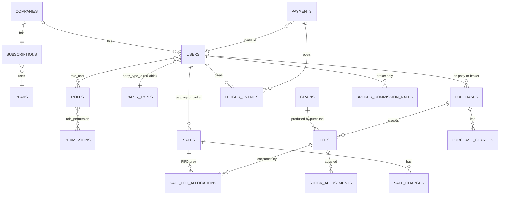

<p align="center"><a href="https://laravel.com" target="_blank"></a></p>

<p align="center">
<a href="https://github.com/laravel/framework/actions"></a>
<a href="https://packagist.org/packages/laravel/framework"></a>
<a href="https://packagist.org/packages/laravel/framework"></a>
<a href="https://packagist.org/packages/laravel/framework"></a>
</p>

## About Laravel

Laravel is a web application framework with expressive, elegant syntax. We believe development must be an enjoyable and creative experience to be truly fulfilling. Laravel takes the pain out of development by easing common tasks used in many web projects, such as:

- [Simple, fast routing engine](https://laravel.com/docs/routing).
- [Powerful dependency injection container](https://laravel.com/docs/container).
- Multiple back-ends for [session](https://laravel.com/docs/session) and [cache](https://laravel.com/docs/cache) storage.
- Expressive, intuitive [database ORM](https://laravel.com/docs/eloquent).
- Database agnostic [schema migrations](https://laravel.com/docs/migrations).
- [Robust background job processing](https://laravel.com/docs/queues).
- [Real-time event broadcasting](https://laravel.com/docs/broadcasting).

Laravel is accessible, powerful, and provides tools required for large, robust applications.

## Learning Laravel

Laravel has the most extensive and thorough [documentation](https://laravel.com/docs) and video tutorial library of all modern web application frameworks, making it a breeze to get started with the framework.

In addition, [Laracasts](https://laracasts.com) contains thousands of video tutorials on a range of topics including Laravel, modern PHP, unit testing, and JavaScript. Boost your skills by digging into our comprehensive video library.

You can also watch bite-sized lessons with real-world projects on [Laravel Learn](https://laravel.com/learn), where you will be guided through building a Laravel application from scratch while learning PHP fundamentals.

## Agentic Development

Laravel's predictable structure and conventions make it ideal for AI coding agents like Claude Code, Cursor, and GitHub Copilot. Install [Laravel Boost](https://laravel.com/docs/ai) to supercharge your AI workflow:

```bash
composer require laravel/boost --dev

php artisan boost:install
```

Boost provides your agent 15+ tools and skills that help agents build Laravel applications while following best practices.

## Contributing

Thank you for considering contributing to the Laravel framework! The contribution guide can be found in the [Laravel documentation](https://laravel.com/docs/contributions).

## Code of Conduct

In order to ensure that the Laravel community is welcoming to all, please review and abide by the [Code of Conduct](https://laravel.com/docs/contributions#code-of-conduct).

## Security Vulnerabilities

If you discover a security vulnerability within Laravel, please send an e-mail to Taylor Otwell via [taylor@laravel.com](mailto:taylor@laravel.com). All security vulnerabilities will be promptly addressed.

## License

The Laravel framework is open-sourced software licensed under the [MIT license](https://opensource.org/licenses/MIT).


# Grain Trading SaaS — System Architecture

Based on your PRD notes (Stock Management System of Grain). This revises the earlier
design: **farmers, traders, brokers, mills are now first‑class rows in the same
`users` table** as staff/admins — because you need to give them login access later
so a farmer/trader/broker can see their own ledger, and a broker can see their
commission. This document also adds the SaaS layer: tenants (companies), subscription
plans/billing, and a business‑admin → staff → permissions hierarchy.

---

## 1. Actors (from your notes)

| Actor | Scope | Created by |
|---|---|---|
| **Super Admin** | Platform-wide (you, the SaaS owner) | — |
| **Business Admin** | One company (tenant) | Super Admin, on onboarding |
| **Staff / Manager** | One company | Business Admin |
| **Farmer / Trader / Mill** | One company (a "party" you buy from / sell to) | Business Admin or Staff |
| **Broker** | One company (a party who also earns commission) | Business Admin or Staff |

All five are rows in **one `users` table** — this is the change from before. What
differs between them is **role** (permissions) and **party_type** (whether they're
also a business contact with a ledger). A user can have `login_enabled = false`
(most farmers, until you're ready to give them a portal) or `true`.

---

## 2. Multi‑tenancy (SaaS) strategy

**Recommendation: single database, shared schema, row‑level tenant isolation.**
Every business table carries a `company_id`. This scales to thousands of tenants,
is far cheaper to run/migrate/backup than database‑per‑tenant, and is the standard
approach for this class of SaaS (comparable to how Notion/Slack workspaces work
internally).

- A Laravel **global scope** (`TenantScope`) auto‑filters every query by
  `auth()->user()->company_id`, so no controller ever has to remember to add
  `->where('company_id', ...)` manually.
- **Super Admin** requests bypass the scope (they manage all tenants).
- Add a **unique composite index** pattern `(company_id, <natural key>)` instead of
  global-unique — e.g. two different companies can both have a grain named "Wheat".
- If one tenant later becomes huge (millions of rows), that single tenant can be
  moved to database‑per‑tenant without changing the rest of the platform — the
  schema below supports either.

```
Request → Auth Middleware → Resolve company_id from logged-in user
        → TenantScope auto-applied to all Eloquent queries
        → SubscriptionActive Middleware (blocks if plan expired/suspended)
        → PlanLimit Middleware (blocks if over user/transaction quota)
        → Permission Middleware (can($ability))
        → Controller
```

---

## 3. Subscription & billing model

```
plans
├── id
├── name                 e.g. Starter / Growth / Enterprise
├── slug
├── price_monthly, price_yearly
├── max_staff_users
├── max_parties            (farmers+traders+brokers+mills combined)
├── max_transactions_month (purchases+sales)
├── features (json)        e.g. {"broker_commission": true, "multi_branch": false}
└── is_active

subscriptions
├── id
├── company_id  (FK companies)
├── plan_id     (FK plans)
├── status        trial | active | past_due | canceled | expired
├── trial_ends_at
├── current_period_start / current_period_end
├── cancel_at_period_end (bool)
├── gateway               stripe | razorpay
└── gateway_subscription_id

subscription_invoices
├── id, company_id, subscription_id
├── amount, status (paid|unpaid|failed)
├── invoice_number
├── due_at, paid_at
```

**Payment gateway:** since amounts are in ₹ and parties deal in quintals/rupees,
use **Razorpay Subscriptions** (or Cashier + Stripe if you'll also serve
international traders). Either way, keep gateway logic behind a `BillingService`
interface so you can swap providers later without touching business logic.

**Enforcement:**
- `EnsureSubscriptionActive` middleware → 402/redirect to billing page if
  `status` is `past_due`/`expired`.
- `EnforcePlanLimits` middleware/service → checks counts against `plans.max_*`
  before allowing a new staff user, party, or transaction — used at the point of
  creation (`PartyObserver`, `UserObserver`, `PurchaseObserver`, `SaleObserver`).

---

## 4. Users, Roles & Permissions

### 4.1 `companies` (tenant)
```
id, name, address, type, email, phone, gstin, logo_path,
signature_stamp_path,   -- for invoices, matches your Step 11
is_active, timestamps
```

### 4.2 `party_types` (lookup)
```
id, name (Farmer, Trader, Broker, Mill), slug
```

### 4.3 `users` — the ONE unified table
```
id
company_id            nullable  -- null only for Super Admin
party_type_id         nullable  -- null = internal staff/admin, set = farmer/trader/broker/mill
name
phone                 unique per company
email                 nullable, unique per company when present
password              nullable  -- null until login_enabled is turned on
address
aadhar_no             nullable
gst_no                nullable
opening_balance        decimal  -- +ve = they owe you, -ve = you owe them
credit_limit           decimal nullable
login_enabled          boolean default false
is_active               boolean default true
created_by              FK users (who added this party/staff)
timestamps, soft deletes
```

This directly satisfies your note: *"jitne v farmer, trader, broker etc hai wo
sab users table se link hona chahiye"* — a farmer today is `login_enabled=false`;
flip it to `true` + send them a password‑set link, and they can log in to see
**only their own ledger** (enforced by policy: `party.user_id === auth()->id()`).

### 4.4 Roles & permissions (fine‑grained, business‑admin assignable)
```
roles
├── id, company_id (nullable = platform role), name, slug, is_system (bool)

permissions
├── id, slug   e.g. parties.create, purchases.create, sales.approve,
│              ledger.view_all, reports.export, commission.view, users.manage

role_permission (pivot)
├── role_id, permission_id

role_user (pivot)
├── user_id, role_id
```

System roles seeded per company on creation: `business_admin` (all permissions),
`staff` (subset, admin picks via checkboxes when creating staff — this is your
"create by the staff assign permission" requirement), `farmer`/`trader`/`broker`
portal roles (very limited: `ledger.view_own`, `commission.view_own` for brokers).

Recommend using **spatie/laravel-permission** under the hood rather than hand
rolling this — it gives you the pivot tables above plus caching, and slots
straight into this schema (just add `company_id` scoping on top).

---

## 5. Core domain schema

### 5.1 Grain & broker setup (Steps 2–3)
```
grains
├── id, company_id, name, unit (default QTL)

broker_commission_rates
├── id, company_id, broker_id (FK users), grain_id
├── commission_type   per_unit | percentage
├── rate              e.g. ₹5/qtl OR 1.5%
├── applies_to        purchase | sale | both
```

### 5.2 Purchase → Lot → Inventory (Steps 4, 6, 7)

Lots are the backbone of FIFO selling (Step 8), so purchases don't write straight
to a stock number — they create a **lot**.

```
lots
├── id, company_id, lot_no (auto or manual), grain_id
├── purchase_id  (FK)
├── initial_quantity, remaining_quantity
├── moisture, rate            -- cost basis, needed for FIFO profit calc
├── status   open | closed
└── created_at

purchases
├── id, company_id, date
├── party_id     FK users (farmer/trader/mill)
├── broker_id    FK users nullable
├── grain_id
├── quantity, unit, moisture, rate
├── total_unit, total_amount
├── notes, created_by
└── soft deletes

purchase_charges         -- "Add on charges like bhaar (weighing) + transport"
├── id, purchase_id, type (weighing|transport|other), amount

grain_stocks              -- cached aggregate, always derived from lots
├── id, company_id, grain_id, quantity  (= SUM of open lots' remaining_quantity)
```

**Flow:** `Purchase created` → `PurchaseObserver` creates a `Lot` with
`remaining_quantity = total_unit` → recalculates `grain_stocks` → if payment
wasn't fully collected, the difference is posted to the party's `ledger_entries`
as outstanding (udhaar), matching your Step 4 note *"Agar udhar hua → Party ke
collect/outstanding me add hoga."*

### 5.3 Selling — FIFO (Step 8)
```
sales
├── id, company_id, date
├── party_id  FK users (customer)
├── broker_id FK users nullable
├── grain_id, quantity, unit, rate, total_amount
├── notes, created_by
└── soft deletes

sale_lot_allocations       -- implements FIFO, and lets you compute profit per sale
├── id, sale_id, lot_id
├── quantity_taken
├── cost_rate               -- copied from the lot at time of sale
└── created_at

sale_charges                -- labour/transport add-ons, same pattern as purchase_charges
├── id, sale_id, type, amount
```

**FIFO logic (service, not DB constraint):** `SaleService::allocate()` pulls
open lots for that grain ordered by `created_at asc`, consumes `remaining_quantity`
oldest‑first across as many lots as needed, writes one `sale_lot_allocations`
row per lot touched, decrements `lots.remaining_quantity`, closes a lot when it
hits zero, then updates `grain_stocks`.

### 5.4 Payments & ledger (Steps 4–5)
```
bank_accounts
├── id, company_id, name, account_no, bank_name, opening_balance

payments
├── id, company_id, party_id (FK users)
├── direction        in | out
├── amount
├── mode              cash | bank | upi | cheque
├── bank_account_id   nullable
├── reference_no      nullable
├── related_type/related_id   -- polymorphic: Purchase, Sale, or null (advance)
├── cash_discount_pct nullable   -- "Cash Discount" from Step 8
├── notes, created_by, date

ledger_entries              -- single source of truth per party, drives Step 5's ledger page
├── id, company_id, party_id (FK users)
├── entry_type   opening_balance | purchase | sale | payment_in | payment_out
│                | advance | commission_earned | commission_paid | adjustment
├── reference_type/reference_id   -- polymorphic link back to Purchase/Sale/Payment/etc
├── debit, credit, balance_after
└── entry_date
```

Every purchase, sale, payment, and commission auto‑writes a `ledger_entries`
row (via model observers) — the party's **profile page (Step 5)** is then just
`ledger_entries->where('party_id', $id)->orderBy('entry_date')`, with filters for
date range / entry type, which covers your *"filter or analytics"* note.

Brokers get the same ledger (their commission postings show up as
`commission_earned` / `commission_paid` rows), which is what lets a broker log in
and *"apna commission dekh paye."*

### 5.5 Stock adjustment (Step 9)
```
stock_adjustments
├── id, company_id, lot_id, grain_id
├── quantity_before, quantity_after
├── reason        damage | quality_decrement | recount | other
├── notes, adjusted_by, date
```
Adjusts `lots.remaining_quantity` directly and logs the delta — never edits
`grain_stocks` by hand.

### 5.6 Invoices & reports (Steps 10–11)
```
invoices
├── id, company_id, invoiceable_type/id (Purchase or Sale)
├── invoice_number (per-company sequence)
├── pdf_path
├── signed  (bool)   -- signature/stamp applied
└── created_at
```
Reports/analytics and Excel export (Step 10–11) are read‑only aggregate queries
over `purchases`, `sales`, `ledger_entries`, `broker_commission_rates` — no new
tables needed, just indexed views/queries (e.g. `company_id + date` composite
indexes on every transaction table).

### 5.7 Audit log (Step 13)
```
audit_logs
├── id, company_id, user_id
├── action        created | updated | deleted
├── model_type, model_id
├── old_values (json), new_values (json)
├── ip_address, created_at
```
Attach via a single `Auditable` trait on every model that matters (users,
purchases, sales, payments, stock_adjustments) — avoids repeating logging code.

---

## 6. Entity relationship overview



---

## 7. Feature/step → module map

| Your step | Module |
|---|---|
| Step 1 (Party create) | `PartyController` → creates a `users` row, `party_type_id` set, `login_enabled=false` |
| Step 2 (Grain Master) | `GrainController` |
| Step 3 (Broker commission) | `BrokerCommissionRateController` |
| Step 4 (Purchase) | `PurchaseController` → `Lot`, `PurchaseCharge`, ledger post |
| Step 5 (Party ledger) | `PartyLedgerController` (or self-service `MyLedgerController` once login enabled) |
| Step 6–7 (Inventory) | `GrainStockController`, auto‑maintained, never manually edited |
| Step 8 (Selling / FIFO) | `SaleService::allocate()`, `SaleController` |
| Step 9 (Stock adjustment) | `StockAdjustmentController` |
| Step 10 (Reports) | `ReportController` (dashboard + exports) |
| Step 11 (Excel/Invoice) | `InvoiceController` (PDF w/ signature), `ExportController` (xlsx) |
| Step 12 (Roles) | `RoleController`, permission checkboxes UI |
| Step 13 (Audit logs) | `Auditable` trait + `AuditLogController` (read-only viewer) |

---

## 8. Recommended package stack

- **spatie/laravel-permission** — roles/permissions (with `company_id` scoping added on top)
- **laravel/sanctum** — API auth if you'll have a mobile app for farmers/brokers
- **razorpay/razorpay** (or laravel/cashier + Stripe) — subscription billing
- **maatwebsite/excel** — Step 11 Excel export
- **barryvdh/laravel-dompdf** (or spatie/browsershot) — invoice PDFs with stamp/signature overlay
- **spatie/laravel-activitylog** — can back the `audit_logs` requirement instead of hand-rolling it

---

## 9. Scaling notes

- Index every transactional table on `(company_id, date)` and `(company_id, grain_id)` — these are your hottest report filters.
- `grain_stocks` is a cache; it should always be re‑derivable by summing `lots.remaining_quantity`, so you can rebuild it if it ever drifts.
- Keep `ledger_entries` **append‑only** (never update/delete a posted row) — corrections go in as new `adjustment` entries. This is what makes the ledger trustworthy for farmers/brokers once they can see it themselves.
- Wrap every multi‑table write (purchase→lot→ledger, sale→allocation→ledger) in a DB transaction with row locks on `grain_stocks`, same pattern as the `StockService` from your last migration set — extend it to also write `ledger_entries`.
- Plan‑limit checks should run on the observer/service layer, not just at the UI, so API usage can't bypass quotas.

---

## 10. Suggested build order

1. `companies`, `plans`, `subscriptions` (SaaS shell) + Super Admin onboarding flow
2. `users`, `party_types`, `roles`, `permissions` (unified auth)
3. `grains`, `broker_commission_rates`
4. `purchases` → `lots` → `grain_stocks` (Steps 4, 6, 7)
5. `ledger_entries`, `payments`, `bank_accounts` (Step 4–5)
6. `sales` → `sale_lot_allocations` (FIFO, Step 8)
7. `stock_adjustments` (Step 9)
8. Reports, exports, invoices (Steps 10–11)
9. Role/permission UI polish (Step 12), audit log viewer (Step 13)
10. Farmer/Trader/Broker self-login portal (flip `login_enabled`, scoped policies)

---

Want me to turn sections 4–5 (schema) into actual Laravel migrations + models next,
the way I did for the earlier version — updated for this unified `users` table
and the lot/FIFO/ledger additions?
# grains

